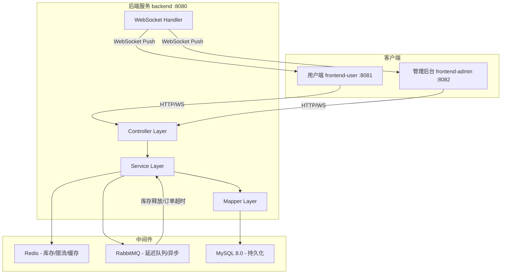
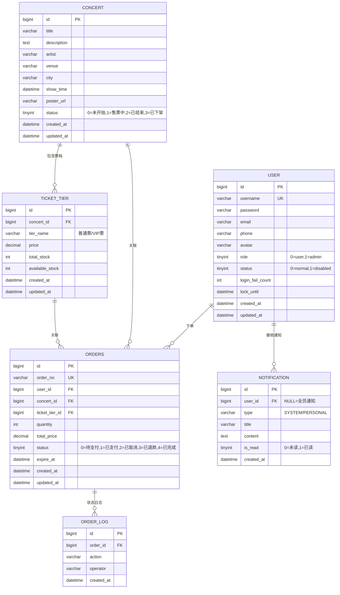

# 演唱会抢票系统 - 项目设计文档

## 1. 系统架构

## 2. ER 图

## 3. 接口清单

### AuthController (`/api/auth`)
| Method | Path | Description |
|--------|------|-------------|
| POST | /register | 用户注册 |
| POST | /login | 用户登录 |

### UserController (`/api/user`)
| Method | Path | Description |
|--------|------|-------------|
| GET | /profile | 获取个人信息 |
| PUT | /profile | 修改个人信息 |
| GET | /list | 管理员-用户列表 |
| PUT | /{id}/status | 管理员-修改用户状态 |

### ConcertController (`/api/concert`)
| Method | Path | Description |
|--------|------|-------------|
| POST | / | 新增演唱会 |
| PUT | /{id} | 修改演唱会 |
| DELETE | /{id} | 删除演唱会 |
| GET | /{id} | 演唱会详情 |
| GET | /list | 演唱会列表(筛选/搜索) |

### TicketTierController (`/api/ticket-tier`)
| Method | Path | Description |
|--------|------|-------------|
| POST | / | 新增票档 |
| PUT | /{id} | 修改票档 |
| DELETE | /{id} | 删除票档 |
| GET | /concert/{concertId} | 查询演唱会票档 |

### GrabTicketController (`/api/grab`)
| Method | Path | Description |
|--------|------|-------------|
| POST | / | 抢票 |

### OrderController (`/api/order`)
| Method | Path | Description |
|--------|------|-------------|
| GET | /my | 我的订单 |
| GET | /list | 管理员-所有订单 |
| POST | /{id}/pay | 模拟支付 |
| POST | /{id}/cancel | 取消订单 |
| POST | /{id}/refund | 退款 |

### NotificationController (`/api/notification`)
| Method | Path | Description |
|--------|------|-------------|
| GET | /list | 通知列表 |
| GET | /unread-count | 未读数量 |
| PUT | /{id}/read | 标记已读 |
| PUT | /read-all | 全部已读 |
| POST | /publish | 管理员-发布公告 |

## 4. UI/UX 规范

- 主色调: `#1a1a2e` (深蓝黑), 强调色: `#e94560` (红), 辅助色: `#16213e`
- 字体: `'Segoe UI', 'PingFang SC', sans-serif`
- 卡片圆角: `12px`, 阴影: `0 4px 20px rgba(0,0,0,0.08)`
- 间距体系: `8px / 16px / 24px / 32px`
- 按钮圆角: `8px`, Hover 过渡: `0.3s ease`
- 成功色: `#27ae60`, 警告色: `#f39c12`, 错误色: `#e74c3c`
